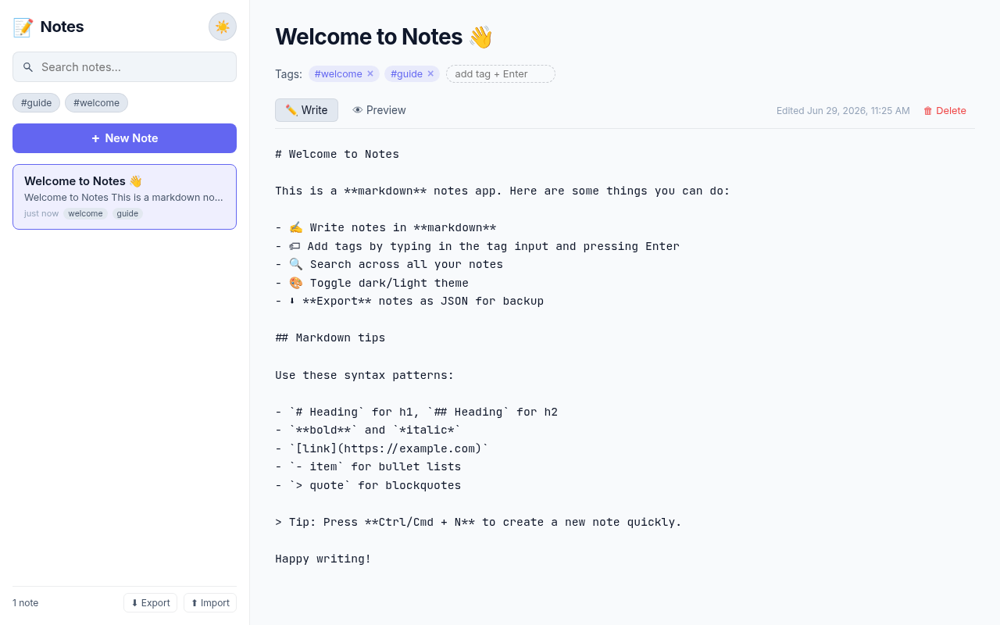

# Notes App

> A clean markdown notes app with tags, search, and dark mode — built with **vanilla HTML, CSS, and JavaScript**. All notes are stored locally in your browser; no account or backend required.


## ✨ Features

- **Markdown editor with live preview** — write in markdown, switch to preview tab to see rendered output
- **Custom markdown parser** — no dependencies; supports headings, bold, italic, lists, links, images, code blocks, blockquotes, and tables
- **Tags** — add tags to organize notes; click a tag chip in the sidebar to filter
- **Full-text search** — instant search across titles, body, and tags
- **Dark / light theme** — auto-detects system preference, remembers your choice
- **Export & import** — back up your notes as JSON and restore them later
- **Auto-save** — every keystroke is saved to `localStorage` immediately
- **Keyboard shortcuts** — `Ctrl/Cmd+N` for a new note
- **Zero dependencies** — pure HTML/CSS/JS

## 📸 Screenshot



## 🚀 Live Demo

| Host | URL | Notes |
|------|-----|-------|
| 🥇 Surge.sh | https://arjun-notes.surge.sh | Bangalore edge — best for India |
| 🥈 GitHub Pages | https://arjundroid12.github.io/notes-app/ | Primary — may be blocked by some Indian ISPs |

## 🛠️ Tech Stack

| Layer     | Tech                          |
|-----------|-------------------------------|
| Markup    | Semantic HTML5                |
| Styling   | CSS Custom Properties         |
| Logic     | Vanilla JavaScript (ES6+)     |
| Markdown  | Custom parser (no library)    |
| Storage   | `localStorage`                |

## 📦 Run Locally

No build tools required:

```bash
git clone https://github.com/arjundroid12/notes-app.git
cd notes-app
# Open index.html in your browser, OR:
python3 -m http.server 8000
# Visit http://localhost:8000
```

## ⌨️ Keyboard Shortcuts

| Shortcut         | Action          |
|------------------|-----------------|
| `Ctrl/Cmd + N`   | Create new note |
| `Enter` (in tag input) | Add tag   |

## 📝 Markdown Syntax Supported

```
# Heading 1
## Heading 2
### Heading 3

**bold**  *italic*  ~~strikethrough~~

- bullet item
- another item

1. numbered item
2. another item

> blockquote

`inline code`

```
code block
```

[link text](https://example.com)


---
(horizontal rule)
```

## 🧪 CI/CD

GitHub Actions workflow (`.github/workflows/ci.yml`) on every push and PR:

- Validates required files exist (`index.html`, `assets/*`, `README.md`, `LICENSE`)
- Runs JavaScript syntax checks with `node --check` on both JS files
- Auto-deploys to GitHub Pages on every push to `main`

## 📁 Project Structure

```
notes-app/
├── .github/
│   └── workflows/
│       └── ci.yml
├── assets/
│   ├── app.js          # App logic, state, persistence, render
│   ├── markdown.js     # Custom markdown renderer (no deps)
│   ├── styles.css      # Theme tokens, layout, editor
│   └── screenshot.png  # README screenshot
├── index.html          # App shell
├── LICENSE
├── README.md
└── .gitignore
```

## 🔐 Privacy

All notes are stored **only in your browser's localStorage**. Nothing is ever sent to a server. Clearing your browser data will delete your notes — use the **Export** button in the sidebar to back them up.

## 📄 License

[MIT](./LICENSE) © Arjun Vashishtha
